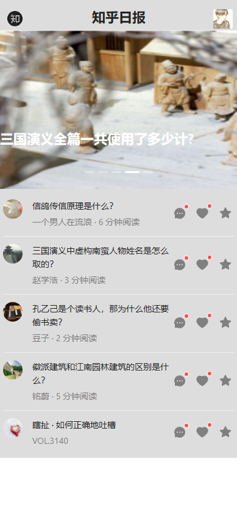
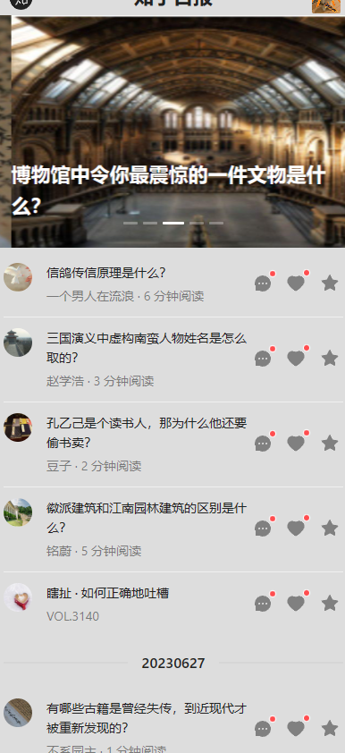
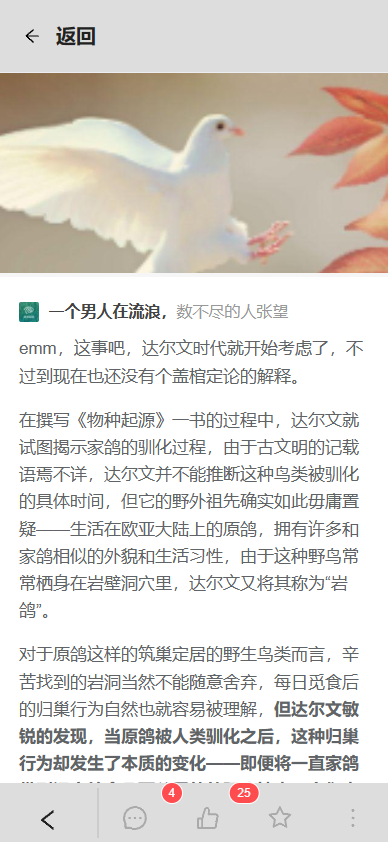
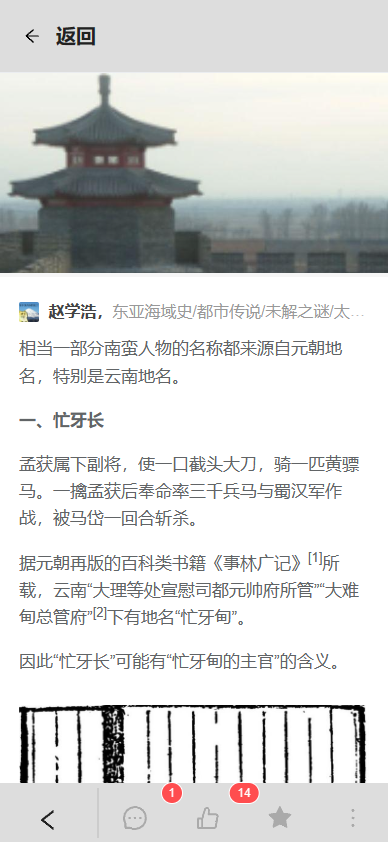
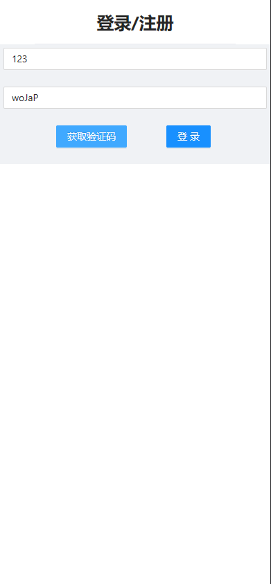
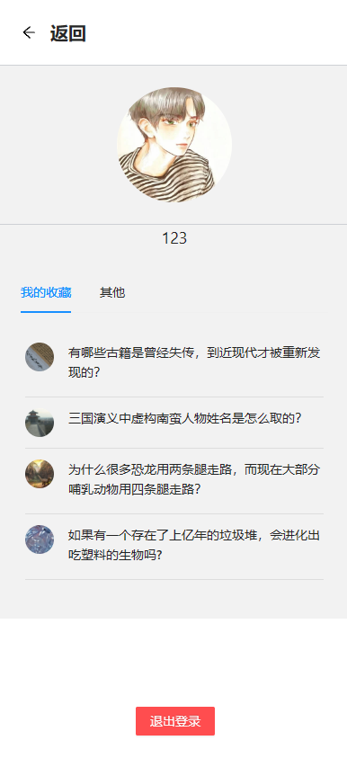
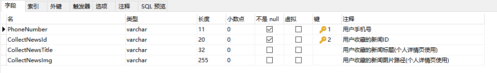

# Imitated-Zhihu-Daily
仿知乎日报系统
# 一、导读
## 系统简介
本系统是一个仿照知乎日报进行设计的前后端分离Web系统，实现了获取每日新闻、账号登录以及收藏等功能。其中前端部分使用的是Vue框架，并且使用了Ant Design Vue 组件库搭建页面。
后端部分使用的是SpringBoot + Mybatis框架，使用MySQL数据库对新闻数据、用户数据等进行存储，系统使用的新闻数据主要从知乎的接口调取。实现了一个简易的仿知乎日报系统。
# 二、系统详情
## 功能需求实现
本系统的功能需求主要包括以下几条：
### 首页：
(1)显示logo以及个人头像。
(2)展示当日最新的新闻，以及其点赞评论情况。
(3)用户向上滑动能够获取前一天或者更早的新闻。
(4)点击新闻能够进入新闻详情页。
(5)未登录情况下点击收藏按钮以及个人头像进入登录页，登录状态下则提示收藏情况或进入个性中心页。
### 新闻详情页：
(1)详细展示新闻内容。
(2)展示该新闻的点赞评论数量，以及用户是否已经收藏过该新闻。
(3)收藏/取消收藏新闻。
### 登录页：
(1)用户能获得随机的验证码
(2)用户能输入手机号并登录
### 个人中心页：
(1)展示个人头像并允许用户更换头像。
(2)展示本用户收藏的新闻内容，点击新闻可进入新闻详情。
(3)退出登录。
### 技术选型：
本系统使用的技术栈如下：
(1)前端框架：Vue
(2)后端框架：Spring Boot
(3)数据库：MySQL
(4)HTTP请求库：Axio
(5)ORM持久层框架：MyBatis
# 三、设计结果
### 首页：

### 新闻详情页：

### 登录页：

### 个人中心页：

### 数据库设计：

